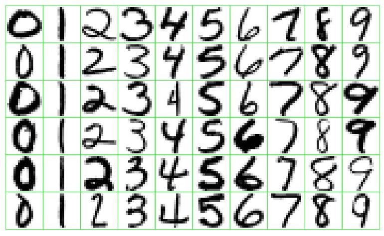
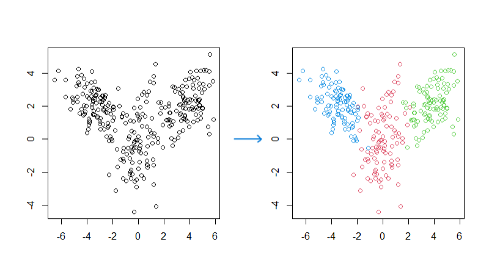

```{r, echo=FALSE}
# source(file = "_environment.local")
htmltools::includeHTML("questions/openai-api.html")
```

# Artificial Intelligence vs. Machine Learning vs. Data Mining

The terms "**artificial intelligence**", "**machine learning**", and "**data mining**" are all used interchangeably. The boundaries between their definitions are ambiguous, with significant overlap. They delineate the uses of computer software to derive insightful solutions that conventional data analysis methods might struggle to attain.

## Artificial Intelligence (AI)

In a broad context, **artificial intelligence (AI)** refers to computer systems exhibiting human-like intelligence and cognitive capabilities. Examples:

-   Deep Blue playing chess (mid-1980s),
-   Watson by IBM (2011),
-   Alpha Go (2014),
-   ChatGPT (2022): designed for generating human-like text responses based on the input it receives. It uses a large-scale deep learning model called GPT (Generative Pre-trained Transformer).

## Machine Learning

Machine learning describes techniques that the machine [integrate self-learning algorithms to uncover hidden patterns and relationships in data]{style="color:red;"}. The Machine learning techniques are designed to evaluate results and be able to improve its performance over time. Its an application of artificial intelligence

Examples: Predict rider demand to strategically dispatch drivers for Uber

### Machine Learning in Different Fields

Learning from data is essential in different scientific disciplines

-   Predict stock returns in the next six months based on historical data;
-   Predict the probability of a loan default based on the customer’s information and historical records;
-   Identify certain diseases based on medical image;
-   Identify handwritten digits from the image;
-   Facial recognition;
-   Natural language processing;
-   Cluster customers based on their purchase behavior and other information

```{r, echo=FALSE, results='asis'}
# source(file = "_environment.local")
htmltools::includeHTML("questions/Q-103-examples.html")
```

## Data Mining

Data mining entails the application of a range of analytical techniques crucial for the advancement of machine learning and artificial intelligence. It is widely acknowledged as a fundamental component of both fields. Through data mining, hidden patterns and relationships within data are unearthed, enabling the extraction of valuable insights to inform decision-making processes.

```{r, echo=FALSE, results='asis'}
# source(file = "_environment.local")
# What is Data Mining with real world example?
htmltools::includeHTML("questions/Q-101-data-mining.html")
```

### Difference between Data Mining and Machine Learning

1.  Data mining focuses on discovering patterns and relationships in a given data
2.  Machine learning focuses on training models and predicting future
3.  A large overlap, but have different focuses
4.  No need to distinguish them conceptually for our course
5.  Article: [Difference between Data Mining and Machine Learning](https://bernardmarr.com/default.asp?contentID=1741)

```{r, echo=FALSE, results='asis'}
# source(file = "_environment.local")
# Why Data Mining is so important nowadays?
htmltools::includeHTML("questions/Q-102-data-mining-why.html")
```

# Data Mining Algorithms

Two types of techniques depending on the way they learn about data.

- **Supervised data mining** techniques are used for developing predictive models.

- **Unsupervised data mining** techniques are effective for data exploration, dimension reduction, and pattern recognition.

- **Semi-supervised learning**: Mixture of both

The key distinction:

  - in **supervised** data mining, [**the target variable is identified**]{style="color:red;"}.
  - in **unsupervised** data mining, [**no target variable is identified**]{style="color:red;"}.

## Supervised data mining

Common applications of supervised data mining include prediction models and classification. 

1. Prediction model: The response variable is [**numerical**]{style="color:red;"}
    - Regression method
    - e.g., stock return, housing price, temperature, spending of a customer.
    
2. Classification model: The response variable is [**categorical**]{style="color:red;"}.
    - e.g., {A, B, C}, {dog, cat}, {0, 1}. 
    - Predict the class memberships of customer.
    - logistic regression model can  do the classification. 

```{r, echo=FALSE}
# source(file = "_environment.local")
# Show me an example of logistic regression model?
htmltools::includeHTML("questions/Q-104-logit.html")
```

### An example: Neural Networks for identifying digits

How to recognize these handwritten digits? 



The neural networks is one of the models that can identify digits. 


Here is an intuitive and complete explanation with animation for identifying digits using neural networks: [What is neural networks](https://www.3blue1brown.com/lessons/neural-networks). 

## Unsupervised data mining

The algorithms allow the computer to identify patterns and relationships in the data without any specific guidance from the analyst.

- Subjective, no simple goal such as prediction
- Common applications: **dimension reduction** and **pattern recognition**
- Other Examples: Recommendation systems, clustering, principle component analysis (PCA), association rules



### Dimension reduction

- Attempt: converts a set of high-dimensional data (large number of variables) into data with lesser dimensions without losing much of the information.
- Why: Reduce information redundancy, improve model stability.
- When: Deploy before other data mining methods.
- When: Relevant for big data to bring out important patterns and build more stable models.
- Example: principle component analysis (PCA): reduce the dimensionality of data while preserving most of the variability present in the dataset. 

### Pattern recognition

- Attempt: recognizing patterns using machine learning.
- Examples: Recurring sequences, Frequent combinations, Recognizable features, Common characteristics.

### Clustering

1. K-Means Clustering: This is a popular clustering algorithm that partitions data into k clusters based on the mean distance between data points and cluster centers. It aims to minimize the intra-cluster variance and is efficient for large datasets.

2. Hierarchical Clustering: This method creates a hierarchy of clusters by either starting with each data point as a single cluster (agglomerative) or starting with all data points in one cluster and recursively splitting them (divisive). It does not require specifying the number of clusters beforehand.

3. Gaussian Mixture Models (GMM): GMM assumes that the data is generated from a mixture of several Gaussian distributions and assigns probabilities to data points belonging to each cluster. It is suitable for data with complex multivariate distributions.

### Association rules

Essentially, association rules reveal how items or attributes are related to each other, based on their co-occurrence or association in transactions or records.

For example, in a retail dataset, association rules can help identify patterns like "If a customer buys product A, they are likely to buy product B as well." This information can be used for market basket analysis, recommendations, and decision-making in various domains.

## Skill sets for Data Science 

