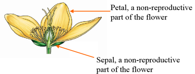

```{r, echo=FALSE}
# source(file = "_environment.local")
htmltools::includeHTML("questions/openai-api.html")
```

# Examples of supervised data mining {#header}

1. In **supervised** data mining, [**the target variable is identified**]{style="color:red;"}
2. The goal is to predict or explain certain outcome
3. Common applications:
    - prediction models 
    - classification models

## Prediction model: response variable is [**numerical**]{style="color:red;"}

  - Regression method
  - e.g., stock return, 
  - housing price, 
  - temperature, 
  - spending of a customer.

```{r, echo=FALSE}
htmltools::includeHTML("questions/Q-121-prediction.html")
```

### Example: Predicting median house value using `Boston` Housing Data

We use Boston Housing Data as an illustrative example in this lab. Boston housing data is a built-in dataset in `MASS` package, so you do not need to download externally. Package `MASS` comes with R when you installed R, so no need to use install.packages(MASS) to download and install, but you do need to load this package.

#### Load Data

```{r}
library(MASS)
data(Boston); #this data is in MASS package
colnames(Boston) 
```

You can find details of the dataset from help document.

```{r eval=FALSE}
?Boston
```

The original data are 506 observations on 14 variables, medv being the response variable $y$:

#### EDA

We have introduced many EDA techniques before. We will only briefly go through some of them here.

```{r}
dim(Boston) 
names(Boston)
str(Boston)
summary(Boston)
```

We skip the Exploratory Data Analysis (EDA) in this notes, but you should not omit it in your real world cases. EDA is very important and always the first analysis to do before any modeling. You should also provide some visualization to present some exploratory analysis. 

```{r, echo=FALSE}
# Give me the sample codes in R to do the exploratory analysis for the "Boston" dataset
htmltools::includeHTML("questions/Q-122-show-vis.html")
```

```{r answer-122, eval=FALSE, echo=FALSE}
# Load the Boston dataset from the MASS library
library(MASS)
data(Boston)

# Display the structure of the dataset
str(Boston)

# Summary statistics of the dataset
summary(Boston)

# Display the first few rows of the dataset
head(Boston)

# Scatter plot of "medv" (median value of owner-occupied homes) against "rm" (average number of rooms per dwelling)
plot(Boston$rm, Boston$medv, xlab = "Average Number of Rooms per Dwelling", ylab = "Median Value of Owner-Occupied Homes", main = "Relationship Between Rooms and Home Value")

# Histogram of "crim" (per capita crime rate by town)
hist(Boston$crim, xlab = "Per Capita Crime Rate", main = "Distribution of Crime Rates")

# Boxplot of "rad" (index of accessibility to radial highways) by "zn" (proportion of residential land zoned for lots over 25,000 sq.ft.)
boxplot(Boston$rad ~ Boston$zn, xlab = "Proportion of Residential Land Zoned", ylab = "Index of Accessibility to Highways", main = "Relationship Between Zoning and Highway Accessibility")

# Correlation matrix of selected variables
cor(Boston[c("crim", "rm", "age", "medv")])

# Pairwise scatterplot matrix of selected variables
pairs(Boston[c("crim", "rm", "age", "medv")])

# In this code snippet:
# 1. We load the "Boston" dataset from the MASS library.
# 2. We display the structure and summary statistics of the dataset.
# 3. We show the first few rows of the dataset.
# 4. We create a scatter plot, histogram, and boxplot to explore relationships between variables.
# 5. We calculate the correlation matrix of selected variables.
# 6. We generate a pairwise scatterplot matrix to visualize relationships between variables.
```

#### Splitting data to training and testing samples 

Next we sample 90% of the original data and use it as the training set. The remaining 10% is used as test set. The regression model will be built on the training set and future performance of your model will be evaluated with the test set.

```{r}
sample_index <- sample(nrow(Boston),nrow(Boston)*0.90)
Boston_train <- Boston[sample_index,]
Boston_test <- Boston[-sample_index,]
```

#### (Optional) Standardization

If we want our results to be invariant to the units and the parameter estimates $\beta_i$ to be comparable, we can standardize the variables. Essentially we are replacing the original values with their z-score.

1st Way: create new variables manually.
```{r, eval=FALSE}
Boston$sd.crim <- (Boston$crim-mean(Boston$crim))/sd(Boston$crim); 
```

This does the same thing.
```{r,eval=FALSE}
Boston$sd.crim <- scale(Boston$crim); 
```

[go to top](#header)

#### Model Building

You task is to build a best model with training data. You can refer to the regression and variable selection code on the slides for more detailed description of linear regression.

The following model includes all $x$ variables in the dataeset
```{r, eval=FALSE}
model_1 <- lm(medv~crim+zn+chas+nox+rm+dis+rad+tax+ptratio+black+lstat, data=Boston_train)
```

To include all variables in the model, you can write the statement this simpler way.

```{r}
model_1 <- lm(medv~., data=Boston_train)
summary(model_1)
```

But, is this the model you want to use?

#### (Optional) Interaction terms in model

If you suspect the effect of one predictor x1 on the response y depends on the value of another predictor x2, you can add interaction terms in model. To specify interaction in the model, you put : between two variables with interaction effect. For example
```{r, eval=FALSE}
lm(medv~crim+zn+crim:zn, data=Boston_train)
#The following way automatically add the main effects of crim and zn
lm(medv~crim*zn, data=Boston_train)
```

For now we will not investigate the interactions of variables. But you can try to do these analyses with the help of EducateUsBot. 

```{r, echo=FALSE}
# Show me sample codes in R to add interaction terms between age and rm to a linear regression model for the "Boston" dataset
htmltools::includeHTML("questions/Q-123-boston-interaction.html")
```

#### Model Assessment 

Suppose that everything in model diagnostics is okay. In other words, the model we have built is fairly a valid model. Then we need to evaluate the model performance in terms of different metrics.

Commonly used metrics include **MSE, (adjusted) $R^2$, AIC, BIC** for in-sample performance, and **MSPE** for out-of-sample performance. 

##### In-sample model evaluation (train error)
MSE of the regression, which is the square of 'Residual standard error' in the above summary. It is the sum of squared residuals(SSE) divided by degrees of freedom (n-p-1). In some textbooks the sum of squred residuals(SSE) is called residual sum of squares(RSS). MSE of the regression should be the unbiased estimator for variance of $\epsilon$, the error term in the regression model.

```{r}
model_summary <- summary(model_1)
(model_summary$sigma)^2
```

$R^2$ of the model
```{r}
model_summary$r.squared
```

Adjusted-$R^2$ of the model, if you add a variable (or several in a group), SSE will decrease, $R^2$ will increase, but Adjusted-$R^2$ could go either way.
```{r}
model_summary$adj.r.squared
```

AIC and BIC of the model, these are information criteria. Smaller values indicate better fit.

```{r}
AIC(model_1)
BIC(model_1)
```

BIC, AIC, and Adjusted $R^2$ have complexity penalty in the definition, thus when comparing across different models they are better indicators on how well the model will perform on future data.

##### Out-of-sample prediction (test error)

To evaluate how the model performs on future data, we use predict() to get the predicted values from the test set.
```{r, eval=FALSE}
#medv_pred is a vector that contains predicted values for test set.
medv_pred <- predict(object = model_1, newdata = Boston_test)
```
Just as any other function, you can write the above statement the following way as long as the arguments are in the right order.

```{r, echo=FALSE}
subset <- sample(nrow(Boston),nrow(Boston)*0.90)
Boston_train <- Boston[subset,]
Boston_test <- Boston[-subset,]
model_1 <- lm(medv~., data=Boston_train)
```

```{r, eval=TRUE}
medv_pred <- predict(model_1, Boston_test)
```

The most common measure is the Mean Squared Prediction Error (MSPE): average of the squared differences between the predicted and actual values

```{r}
mean((medv_pred - Boston_test$medv)^2)
```

A less popular measure is the Mean Absolute Prediction Error (MAPE). You can probably guess that here instead of taking the average of squared error, MAE is the average of absolute value of error.
```{r}
mean(abs(medv_pred - Boston_test$medv))
```

Note that if you ignore the second argument of predict(), it gives you the in-sample prediction on the training set:
```{r, eval=FALSE}
predict(model_1)
```

Which is the same as
```{r, eval=FALSE}
model_1$fitted.values
```

[go to top](#header)


## Classification model: response variable is [**categorical**]{style="color:red;"}

  - generalized linear regression, CART, gradient boosting, neural network, deep learning
  - example: problems that has response as {A, B, C}, {dog, cat}, {0, 1}. 
  - logistic regression model can do the classification. 

### Example: Predicting binary purchase action using [`Purchase`](examples/Purchase.csv) dataset

Suppose we need predict whether a customer will purchase a product based on factors like their age, gender, browsing history, and the time of day they visit the website.

#### Splitting the data into training and testing sets

```{r}
library(readr)
Purchase <- read_csv("examples/Purchase.csv")
View(Purchase)

sample_index <- sample(nrow(Purchase),nrow(Purchase)*0.80)
train <- Purchase[sample_index,]
test <- Purchase[-sample_index,]
```

#### Fitting a logistic regression model

The estimated coefficient of a logistic model does not allow us to determine the partial effect of a predictor variable on the probability.
It is preferable to interpret logistic regression coefficients in terms of odds rather than probabilities.
Odds are defined as the **ratio of the probability of success and the probability of failure**.

Let $p = p(y = 1)$, between $[0,1]$.

Odds = $\frac{p}{1-p}$, between 0 and infinity. 

After fitted, the odds(logit) can be expressed as $\frac{\hat{p}}{(1-\hat{p})}= \exp(b_0 + b_1 x_1)$. 

- The natural log of the odds (logit) is a linear function. $\log{odds}= b_0 + b_1 x_1$
- So the $b_1\times 100$ is is the approximate percentage change in the odds when the predictor variable increases by one unit.

```{r}
# Fitting a logistic regression model
model <- 
  glm(Purchase ~ Age + Browsing_History +
        Gender + Time_Of_Day, 
      data=train, 
      family='binomial')
summary(model)
```

#### Making predictions

```{r}
train_pred <- predict(model, newdata=train, type='response')
test_pred <- predict(model, newdata=test, type='response')
```

What about purchase probability of a female, 35-year-old customer who has browsed the product in the evening?

```{r, eval=FALSE, echo=FALSE}
predict(model, newdata = data.frame(Age=35, 
                                    Gender = "Female", 
                                    Browsing_History = 1, 
                                    Time_Of_Day = "Evening"), 
        type = "response")
```

#### Evaluating the model

```{r, echo=FALSE}
# How should I evaluate a logistic regression model?
htmltools::includeHTML("questions/Q-125-purchase-evaluate.html")
```

```{r}
# Evaluating the accuracy
train_accuracy <- mean((train_pred > 0.5) == train$Purchase)
print(paste('Train_Accuracy:', train_accuracy))
test_accuracy <- mean((test_pred > 0.5) == test$Purchase)
print(paste('Test_Accuracy:', test_accuracy))


# Calculating AUC for training and testing sets

library(pROC)
train_auc <- roc(train$Purchase, train_pred)
test_auc <- roc(test$Purchase, test_pred)

```

[go to top](#header)

# Example of unsupervised data mining

## Clustering

**K-Means Clustering**: This is a popular clustering algorithm that partitions data into k clusters based on the mean distance between data points and cluster centers. It aims to minimize the intra-cluster variance and is efficient for large datasets.

### Example: Clustering Iris flowers in `Iris` dataset

Let's first load the **Iris** dataset. This is a very famous dataset in almost all data mining, machine learning courses, and it has been an R build-in dataset. The dataset consists of 50 samples from each of three species of Iris flowers (Iris setosa, Iris virginicaand Iris versicolor). Four features(variables) were measured from each sample, they are the **length** and the **width** of sepal and petal, in centimeters. It is introduced by Sir Ronald Fisher in 1936 with 3 Iris Species.


- Four features of flower: **length** and the **width** of sepal and petal



The *iris* flower data set is included in R. It is a data frame with 150 cases (rows) and 5 variables (columns) named Sepal.Length, Sepal.Width, Petal.Length, Petal.Width, and Species.


```{r, echo=FALSE}
# Why do we apply clustering analysis to the Iris dataset?
htmltools::includeHTML("questions/Q-124-iris-curious.html")
```

First, load iris data to the current workspace. This is a random grouping (first step).
 
```{r}
data("iris")

# Scale the Iris dataset columns (excluding columns 2, 4, and 5)
iris1 <- scale(iris[,-c(2,4,5)])

# Get the number of rows in the scaled dataset
n <- nrow(iris1)

# Create a random index sample for splitting the dataset
index <- sample(2, n, replace = TRUE)

# Create two subsets based on the random index
iris.sub1 <- iris1[index == 1,]
iris.sub2 <- iris1[index == 2,]

# Calculate the mean of each column in the subsets
mean.sub1 <- apply(iris.sub1, 2, mean)
mean.sub2 <- apply(iris.sub2, 2, mean)

# Plot the scaled Iris dataset with different colors based on the subset index
plot(iris1, col = index + 1, pch = 16)

# Plot the mean of each subset as points in different colors
points(x = mean.sub1[1], y = mean.sub1[2], col = 2, pch = 8)
points(x = mean.sub2[1], y = mean.sub2[2], col = 3, pch = 8)
```

The next step

```{r}
# Define a function 'Eudist' to calculate Euclidean distance between two vectors
Eudist <- function(x, y) sqrt(sum((x - y)^2))

# Calculate Euclidean distance between mean.sub1 and each row in iris1
d1 <- sapply(1:n, function(i) Eudist(mean.sub1, iris1[i,]))

# Calculate Euclidean distance between mean.sub2 and each row in iris1
d2 <- sapply(1:n, function(i) Eudist(mean.sub2, iris1[i,]))

# Determine the index of the minimum distance for each row to assign to a new index
index.new <- apply(cbind(d1, d2), 1, which.min)

# Create new subsets 'iris.sub1' and 'iris.sub2' based on the new index
iris.sub1 <- iris1[index.new == 1,]
iris.sub2 <- iris1[index.new == 2,]

# Calculate the mean of each column in the new subsets
mean.sub1 <- apply(iris.sub1, 2, mean)
mean.sub2 <- apply(iris.sub2, 2, mean)

# Create a scatter plot of iris1 with points colored based on the new index
plot(iris1, col = index.new + 1, pch = 16)

# Plot the mean of each new subset as points in different colors on the scatter plot
points(x = mean.sub1[1], y = mean.sub1[2], col = 2, pch = 8)
points(x = mean.sub2[1], y = mean.sub2[2], col = 3, pch = 8)
```

```{r}
# Calculate the Euclidean distance between 'mean.sub1' and each row in 'iris1' and store in 'd1'
d1 <- sapply(1:n, function(i) Eudist(mean.sub1, iris1[i,]))

# Calculate the Euclidean distance between 'mean.sub2' and each row in 'iris1' and store in 'd2'
d2 <- sapply(1:n, function(i) Eudist(mean.sub2, iris1[i,]))

# Determine the index of the minimum distance between 'd1' and 'd2' for each row and assign to 'index.new'
index.new <- apply(cbind(d1, d2), 1, which.min)

# Create new subsets 'iris.sub1' and 'iris.sub2' based on 'index.new'
iris.sub1 <- iris1[index.new == 1,]
iris.sub2 <- iris1[index.new == 2,]

# Calculate the mean of each column in the new subsets
mean.sub1 <- apply(iris.sub1, 2, mean)
mean.sub2 <- apply(iris.sub2, 2, mean)

# Create a scatter plot of 'iris1' with points colored based on 'index.new'
plot(iris1, col = index.new + 1, pch = 16)

# Plot the mean of 'iris.sub1' as points in color 2 on the scatter plot
points(x = mean.sub1[1], y = mean.sub1[2], col = 2, pch = 8)

# Plot the mean of 'iris.sub2' as points in color 3 on the scatter plot
points(x = mean.sub2[1], y = mean.sub2[2], col = 3, pch = 8)
```


[go to top](#header)