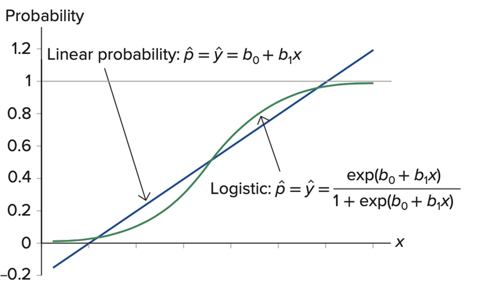

```{r include=FALSE}
knitr::opts_chunk$set(message=FALSE)
source(file = "questions/educateusgpt.R")
```

# Logistic regression and classifications

Please read the lecture to gain the understanding of logistic regression.

# Application 1: Mortgage loan

The Great Recession has forced financial institutions to be extra stringent in granting mortgage loans. Thirty recent mortgage applications are obtained to analyze the mortgage approval rate.

The response variable $y$ equals 1 if the mortgage loan is approved, 0 otherwise.
It is believed that approval depends on the percentage of the down payment ($x_1$) and the percentage of the income-to-loan ratio ($x_2$).

## Download and import the [`Morgage.csv`](examples/Morgage.csv) dataset

```{r, message=FALSE}
library(readr)
Morgage <- read_csv("examples/Morgage.csv", show_col_types = FALSE)
```

```{r, echo=FALSE}
library(kableExtra)
Morgage %>%
  kbl() %>%
  kable_paper(full_width = F, position = "center") %>%
  scroll_box(width = "500px", height = "200px")
```

## Fit the linear probability model

The **linear probability model** is a straightforward approach in statistics and econometrics that models the relationship between a binary outcome (like Yes/No) and one or more predictor variables using linear regression techniques.

Try to ask EducateUsGPT assistant to figure out the codes that can help you to develop the linear probability model for the mortgage dataset. 

```{r, echo=FALSE, results='asis'}
# Me: How to fit a linear probability model in R for the dataset that has y as response, x1 and x2 as predictors?
htmltools::includeHTML("questions/Q-321-LPM.html")
```

After calling the help from the EducateUsGPT assistant, you can double check if your codes could fit the similar linear probability model as follows: 

```{r, echo=TRUE, results='hide'}
# Assuming your dataset is named 'data'
LPM_mod <- lm(y ~ x1 + x2, data = Morgage)

# Print the summary of the model
summary(LPM_mod)
```

## Fit the logistic regression model

Try to ask EducateUsGPT assistant to figure out the codes that can help you to develop the logistic regression model for the mortgage dataset. 

```{r, echo=FALSE, results='asis'}
# Me: What question you should ask?
htmltools::includeHTML("questions/Q-322-Logit.html")
```

After calling the help from the EducateUsGPT assistant, you can double check if your codes could fit the logistic regression model as follows: 

```{r, echo=TRUE, results='hide'}
# Dataset is named as 'Morgage'
Logit_mod <- glm(y ~ x1 + x2, data = Morgage, family = binomial)

# Print the summary of the model
summary(Logit_mod)
```

## Compare these two models

Compare and interpret the estimation of the two models you developed above. 

```{r, echo=FALSE, message=FALSE, results='asis'}
library(stargazer)
stargazer(LPM_mod, Logit_mod, 
          type = "html")
```

## Predict a loan application

Predict the loan approval probability for an applicant with a 20% down payment and a 30% income-to-loan ratio using the two models respectively.

```{r, echo=TRUE}
# Predict using LPM
predict(LPM_mod, 
        newdata = data.frame(x1 = 20, x2 = 30), 
        type='response')
# Predict using logistic regression model
predict(Logit_mod, 
        newdata = data.frame(x1 = 20, x2 = 30), 
        type='response')
```

What if the down payment was 5%, income-to-loan ratio was 20%?

```{r, eval=TRUE, echo=TRUE}
# Predict using LPM
predict(LPM_mod, 
        newdata = data.frame(x1 = 5, x2 = 20), 
        type='response')
# Predict using logistic regression model
predict(Logit_mod, 
        newdata = data.frame(x1 = 5, x2 = 20), 
        type='response')
```

> Why the linear probability model is not appropriate for the prediction of a binary outcome?
> 
> Hint: what you've found from the prediction above. 

```{r Q-325, echo=FALSE, results='asis'}
id <- 325
que <- "What is the drawback of the linear probability model?"
filename <- educateusgpt(id = id, question = que)
htmltools::includeHTML(filename)
```



As shown in the above figure, the linear probability model can lead to predicted probabilities that are outside the range of 0 to 1 at the extreme ends of the predictor variable values. The predicted probabilities that are negative or greater than 100% are not meaningful and interpretable. So it is more appropriate to use a logistic regression model for the classification of the problems with a binary outcome such that the predicted probability is always within the rage of 0 to 1. 

## Predict all applications in training and testing sets

For the logistic regression models, you can predict the log odds ratio, the probability being 1, or you can have binary predicted outcome of 0 or 1 given a cut-off probability. 

1. In logistic regression, the $\hat{\eta}$ are called **log odds ratio**, which is $\log(P(y_i=1)/(1-P(y_i=1)))$. The fitted model $\hat{\eta} = b_0 +b_1 x_1 + b_2 x_2 + ...$ provides the estimated log odds ratio before the inverse of link (such as the logit function in logistic regression). In R, the `predict()` function is utilized to obtain a vector containing all in-sample $\hat{\eta}$ values for each training observation.

```{r, fig.width=6, fig.height=4, fig.align='center'}
hist(predict(Logit_mod))
```

2. To calculate the **predicted probability** $P(y_i=1)$, you apply the inverse of the link function (in this case, the logit function) to $\hat{\eta}$. This is expressed by the equation $P(y_i=1) = 1 / (1 + \exp(-\hat{\eta}_i))$. In R, you can obtain the predicted probability for each training observation using either the `fitted()` function or `predict(, type="response")`.

```{r, fig.width=6, fig.height=4, fig.align='center'}
pred_resp <- predict(Logit_mod, type="response")
hist(pred_resp)
```

3. Finally, consider the necessity of a binary classification decision rule. An intuitive rule is to assign the outcome a value of 1 if the estimated probability ($P(y=1)$) exceeds 0.5. This threshold probability of 0.5 is commonly referred to as the **cut-off probability**. However, it's crucial to note that you have the flexibility to adjust this cut-off probability according to various factors such as the misclassification rate or the implications of the decision. For instance, one may weigh the cost function, which assesses the balance between the risk of approving a loan for someone unable to repay (predicting 0 when the truth is 1) and the risk of denying a loan to someone who is qualified (predicting 1 when the truth is 0).

These tables (confusion matrix) below illustrate the impact of choosing different cut-off probabilities. Choosing a large cut-off probability will result in few cases being predicted as 1, and choosing a small cut-off probability will result in many cases being predicted as 1.

```{r}
# This line of code generates a contingency table comparing the actual values of the response variable 'y' in the Logit_mod dataset 
# with the predicted values obtained from the logistic regression model 'pred_resp'. 
# The predicted values are dichotomized using a threshold of 0.5, where any value greater than 0.5 is classified as 1 and any value less than or equal to 0.5 is classified as 0. 
# The resulting table displays the counts of observations where the actual value and the predicted value fall into each category.
table(Logit_mod$y, (pred_resp > 0.5)*1, dnn=c("Truth","Predicted"))

# This line of code is similar to the previous one, but it uses a different threshold value of 0.2 to dichotomize the predicted values. 
# Consequently, the resulting table provides counts of observations based on a lower threshold for predicting the positive class (1).
table(Logit_mod$y, (pred_resp > 0.2)*1, dnn=c("Truth","Predicted"))

# This line of code again generates a contingency table, but this time using an extremely low threshold value of 0.0001 to dichotomize the predicted values. 
# As a result, almost all predicted values are likely to be classified as 1. 
# This table helps to understand the impact of setting an extremely low threshold on the classification of observations.
table(Logit_mod$y, (pred_resp > 0.0001)*1, dnn=c("Truth","Predicted"))
```


```{r Q-326, echo=FALSE, results='asis'}
id <- 326
que <- "what is the limitation of evaluating confusion matrix of the logistic regression model with only one specific cut-off-probability?"
filename <- educateusgpt(id = id, question = que)
htmltools::includeHTML(filename)
```

> One limitation is that the choice of the cut-off probability can significantly impact the model evaluation metrics such as accuracy, precision, recall, and F1 score. Different cut-off probabilities can lead to different trade-offs between true positive rate and false positive rate, making it challenging to accurately assess the model's overall performance.
> 
> Practitioners often use Receiver operating characteristic (ROC) curves or precision-recall curves evaluate the model's performance across various cut-off probabilities and gain a more comprehensive understanding of its predictive power.

## Fitting performance 

> Why should we evaluate fitting performance of a logistic regression model?
> 
> 1. **Model Validation**: validatting model's effectiveness in capturing the underlying relationships between the predictors and the target variable.
> 
> 2. **Model Comparison**: we may need to try a few different models and select the one that best balances model complexity and fitting performance. Metrics like pseudo-$R^2$, AIC, and BIC help in comparing models with different combination of predictors to find the effective model. 

There are a few key metrics one can use to evaluate the fitting performance of a logistic regression model. For example, 

- **AIC and BIC**, 
- **Residual deviance** (equivalent to SSE in linear regression model),
- **mean residual deviance**, 
- **pseudo-$R^2$**, 
- **Likelihood Ratio Test**

### AIC and BIC 

> Why is the information criteria useful for evaluating logistic regression model's performance?
> 
>  AIC and BIC try to find the best model that minimizes the information loss in representing the data. They achieve this by penalizing models for their complexity, effectively discouraging the inclusion of unnecessary variables that do not significantly improve the model's performance.

Akaike Information Criterion (AIC): 
$$\text{AIC} = -2 * \text{log-likelihood} + 2 * p$$

- where $\text{log-likelihood}$ is the maximized value of the likelihood function of the model.
- $p$ is the number of parameters in the model.

Bayesian Information Criterion (BIC): 
$$BIC = -2 * \text{log-likelihood} + \log(n) * p$$

- $n$ is the sample size.
- $p$ is the number of parameters in the model.

Lower values of AIC and BIC indicate a better fit, taking into account the trade-off between model complexity and fit. One can use them to compare different models and choose the one that provides a good balance between goodness of fit and complexity, helping to avoid overfitting and select the most appropriate model for the given data.

```{r, echo=FALSE, results='asis'}
id <- 324
que <- "How to calculate the AIC and BIC for a logistic regression model in R?"
filename <- educateusgpt(id = id, question = que)
htmltools::includeHTML(filename)
```

```{r, echo=TRUE}
# AIC() and BIC() function can work with linear models and logistic models.
cat("AIC of Linear probability model:", AIC(LPM_mod))
cat("BIC of Linear probability model:", BIC(LPM_mod))

cat("AIC of logistic regression model:", AIC(Logit_mod))
cat("BIC of logistic regression model:", BIC(Logit_mod))
```

### Residual deviance and mean residual deviance

> Why the residual deviance can be used for evaluating a logistic regression model
> 
> It assesses how well a logistic regression model fits the data. It is the difference between the deviance of the model being evaluated and the deviance of a saturated model (a model with a perfect fit). In simpler terms, residual deviance tells us how much information about the response variable is not explained by the model.

$$D = 2\log\left(\frac{L_{sat}(\hat{\beta})}{L_{model}(\hat{\beta})}\right) = 2(\ell_{sat}(\hat{\beta})-\ell_{model}(\hat{\beta})),$$ where 

- $\ell_{sat}(\hat{\beta})$ is the log-likelihood of the full (saturated) model that measures how well the model predicts the observed data. 
- $\ell_{model}(\hat{\beta})$ is the log-likelihood of the fitted model. 

A lower residual deviance indicates a better fit of the model to the data, while a higher residual deviance suggests that the model does not fit the data well.

```{r}
# training set residual deviance
Logit_mod$deviance
# training set mean residual deviance using df 
Logit_mod$deviance/Logit_mod$df.residual 
```

> A comprehensive explanation for the saturated models and deviance is [here](https://www.youtube.com/watch?v=9T0wlKdew6I) 

### Pseudo-$R^2$

Ordinary least squares (OLS) $R^2$ is designed as a goodness-of-fit measure for the regression models with the continuous dependent variable. It indicates the overall explanatory power of a model.

$$ R^2 = 1 - \frac{\sum_{i}(y_i - \hat{y}_i)^2}{\sum_{i}(y_i - \bar{y})^2} = 1 - \frac{SSR}{SST} $$

- where $y_i$ represents the actual values of the response variable,
- $\hat{y}_i$ represents the predicted values,
- $\bar{y}$ represents the mean of the response variable,
- $SSR$ is the sum of squared residuals,
- $SST$ is the total sum of squares.

However, for generalized linear models where the response variable is binary or ordinal, an equivalent and well-performed statistic to R-squared has long been sought. Many studies attempted to develop an analogous notion of $R^2$ for categorical data analysis, including the Surrogate $R^2_{Surr}$ by Liu et al. (2023), McFadden's $R^2_{McF}$ (McFadden, 1973) and McKelvey and Zavoina's $R^2_{MZ}$ (1975). 

For logistic regression models, 

**Surrogate $R^2_S$** is: 
$$ R^2_{S}= \text{the OLS } R^2 \text{ based on the simulated surrogate responses } S,$$

- $S$ is the surrogate response simulated from a fitted linear model as shown below $$S = \hat{\alpha}_1 + \hat{\beta}_1 X_1 + \cdots + \hat{\beta}_p X_p + \varepsilon, \varepsilon \sim Logistic(0,1)$$ 

McFadden's $R^2_{McF}$ is: 
$$ R^2_{McF} = 1 - \frac{\ln(L_M)}{\ln(L_0)},$$

- $L_M$ is log likelihood of the fitted model 
- $L_0$ is log likelihood of the model with just the intercept (the null model). 

McKelvey and Zavoina's $R^2_{MZ}$ is: 
$$ R^2_{MZ}=\frac{\sum_{i=1}^n (\hat{z}_i - {\bar{z}})^2}{\sum_{i=1}^n (\hat{z}_i - {\bar{z}})^2 + n\pi^2/3},$$

- $\hat{z}_i = x_{1i}{\beta}_1+\cdots+x_{q1,i}{\beta}_q$,
- ${\bar{z}} = \sum_{i=1}^n \hat{z}_i /n$


```{r}
# Surrogate R-squared of training set
library(SurrogateRsq)
surr_rsq(model = Logit_mod, 
         full_model = Logit_mod)

# McFadden's Pseudo R-squared of training set
DescTools::PseudoR2(Logit_mod, which = "McFadden")

# McKelvey and Zavoina's Pseudo R-squared of training set
DescTools::PseudoR2(Logit_mod, which = "McKelveyZavoina")
```

> A explanation of commonly encountered Pseudo R-squareds is [here](https://stats.oarc.ucla.edu/other/mult-pkg/faq/general/faq-what-are-pseudo-r-squareds/)

# Application 2: Spam detector

Jennifer Lee is a data scientist working for a telecommunications company. The company has been experiencing a surge in customer complaints about receiving spam and phishing emails that attempt to steal personal information. Jennifer is tasked with developing a machine learning model to detect and filter out these useless or malicious emails. Her objective is to implement spam filters that analyze the email content for suspicious URLs, phishing keywords, and unusual sender behavior to proactively protect customers from falling victim to phishing attacks.

The objective is to detect spam based on the number of recipients, the number of hyperlinks, and the number of characters for each email.

## Download and import the [`Spam.csv`](examples/Spam.csv) dataset

```{r, message=FALSE}
library(readr)
Spam <- read_csv("examples/Spam.csv")
```

```{r, echo=FALSE}
library(kableExtra)
Spam %>%
  kbl() %>%
  kable_paper(full_width = F, position = "center") %>%
  scroll_box(width = "500px", height = "200px")
```

## Splitting the data into training and testing sets

```{r, eval=FALSE, echo=TRUE}
sample_index <- 
train <- 
test <- 
```

```{r, echo=FALSE}
sample_index <- sample(nrow(Spam),nrow(Spam)*0.80)
train <- Spam[sample_index,]
test <- Spam[-sample_index,]
```

## Fit the logistic regression model

Develop the logistic regression model for the Spam dataset. 

```{r, echo=FALSE, results='hide'}
# Assuming your dataset is named 'Spam'
Logit_mod <- glm(Spam ~ Recipients + Hyperlinks + Characters,
                 data = train, 
                 family = binomial)

# Print the summary of the model
summary(Logit_mod)
```

If you cannot write your own codes, try to ask EducateUsGPT assistant to help you out. 

```{r, echo=FALSE, results='asis'}
# Me: What question you should ask?
htmltools::includeHTML("questions/Q-323-Logit-spam.html")
```

## Making predictions

```{r}
train_pred <- predict(Logit_mod, newdata=train, type='response')
test_pred <- predict(Logit_mod, newdata=test, type='response')
```

## Evaluating the model

```{r Q-327, echo=FALSE, results='asis'}
id <- 327
que <- "What are the popular evaluation metrics of a logistic regression model?"
filename <- educateusgpt(id = id, question = que)
htmltools::includeHTML(filename)
```

### Accuracy ratio 

It measures the proportion of correctly classified instances out of the total instances.

$$\text{Accuracy} = \frac{\text{Number of Correct Predictions}}{\text{Total Number of Predictions}} \times 100\% $$
Based on the confusion matrix we introduced before, the accuracy ratio can be written as: 
$$\text{Accuracy} = \frac{TP + TN}{TP + TN + FP + FN} \times 100\%$$

```{r}
# Evaluating the accuracy
train_accuracy <- mean((train_pred > 0.5) == train$Spam)
print(paste('Train_Accuracy:', train_accuracy))
test_accuracy <- mean((test_pred > 0.5) == test$Spam)
print(paste('Test_Accuracy:', test_accuracy))
```

### ROC Curve and area under the ROC curve (AUC-ROC)

We will thoroughly introduce the ROC and AUC-ROC in a separate tutorial. 

```{r}
# Calculating AUC for training and testing sets
library(pROC)
train_auc <- roc(train$Spam, train_pred)
test_auc <- roc(test$Spam, test_pred)
train_auc; test_auc
```


```{r, echo=FALSE}
# Need to put the openai-api file to the very end
# since this file will be updated for every new
# chat questions inserted, so the ids need to be 
# included untill all of these questions are added.
htmltools::includeHTML("questions/openai-api.html")
```

[go to top](#header)
