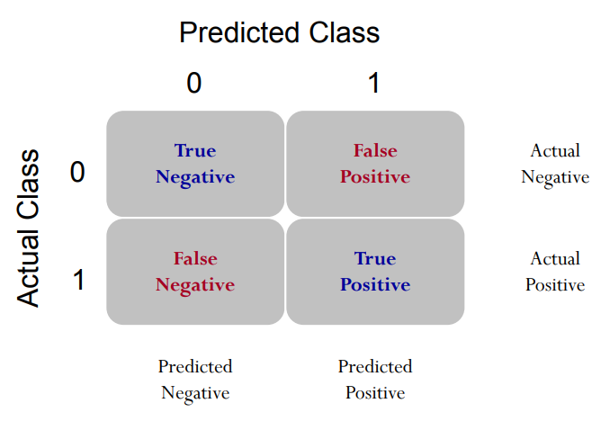
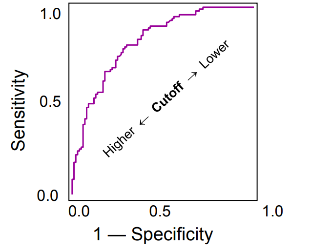

```{r include=FALSE}
knitr::opts_chunk$set(message=FALSE)
source(file = "questions/educateusgpt.R")
```

# Logistic regression and ROC

Practitioners often seek to evaluate the overall goodness of a classification model. However, model evaluation metrics such as accuracy, precision, recall, and F1 score can be significantly impacted by the choice of the cut-off probability, making it challenging to accurately assess the model's overall performance.

Hence, one of the most popular tools is the Receiver Operating Characteristic (ROC) curve or Precision-Recall (PR) curve. The ROC or PR curves evaluate the model's performance across various cut-off probabilities and help gain a more comprehensive understanding of its predictive power.

## ROC Curve

Receiver Operating Characteristic (ROC) curve is a graphical representation that showcases the performance of a classification model across different classification thresholds. The ROC curve plots the true positive rate TPR (sensitivity) against the false positive rate FPR (1-specificity) at various threshold settings. 

True positive rate, $\text{TPR}=\frac{\text{TP}}{\text{TP+FN}}$: is the proportion of true positives correctly predicted as positive.

False positive rate, $\text{FPR}=\frac{\text{FP}}{\text{FP+TN}}=1-\frac{\text{TN}}{\text{FP+TN}}$: is the proportion of true negatives incorrectly predicted as positive.

<kbd>{width=45%}</kbd> <kbd>{width=45%} </kbd>


# Example: Credit Card Default

We will use a Credit Card Default Data for this lab and illustration. The details of the data can be found at [here](http://archive.ics.uci.edu/ml/datasets/default+of+credit+card+clients). Think about what kind of factors could affect people to fail to pay their credit balance. This study emphasizes that accurately estimating default probability is more valuable for risk management than a binary classification of clients as credible or not credible. 

This dataset usually includes various features such as demographic information (age, gender, education), credit card usage details (credit limit, balance, payment history), and whether or not the cardholder defaulted on their payments.

```{r, message=FALSE}
# Importing credit data from a CSV file hosted online.
# The 'read.csv()' function is used to read the data from the specified URL.
# 'header=T' indicates that the first row of the CSV file contains column names.
credit_data <- read.csv(file = "https://xiaorui.site/Data-Mining-R/lecture/data/credit_default.csv", header = TRUE)
```

## A brief exploratory data analysis 

Explore what information do we have.
```{r}
colnames(credit_data)
```

Let's look at how many people were actually default in this sample.
```{r}
table(credit_data$default.payment.next.month)
```

The name of response variable is too long! I want to make it shorter by renaming. Recall the `rename()` function.
```{r message=FALSE}
library(dplyr)
credit_data <- rename(credit_data, default=default.payment.next.month)
```

How about the variable type and summary statistics?
```{r eval=FALSE}
str(credit_data)    # structure - see variable type
summary(credit_data) # summary statistics
```

We see all variables are **int**, but we know that *SEX, EDUCATION, MARRIAGE* are categorical, we convert them to **factor**, the categorical variable type in R.

```{r}
credit_data$SEX <- as.factor(credit_data$SEX)
credit_data$EDUCATION <- as.factor(credit_data$EDUCATION)
credit_data$MARRIAGE <- as.factor(credit_data$MARRIAGE)
```

*We omit other EDA, but you shouldn't whenever you are doing data analysis.*

## Fit logistic regression model

Randomly split the data to training (80%) and testing (20%) datasets:

```{r}
index <- sample(nrow(credit_data),nrow(credit_data)*0.80)
credit_train <- credit_data[index,]
credit_test <- credit_data[-index,]

# or use a more straightforward splitting
# credit_train <- credit_data[1:10000,]
# credit_test <- credit_data[10001:12000,]
```

Train a logistic regression model with all variables:

```{r, warning=FALSE}
credit_logit <- 
  glm(default~., 
      family = binomial, 
      data = credit_train)
summary(credit_logit)
```

You have seen `glm()` before. In this lab, this is the main function used to build logistic regression model because it is a member of generalized linear model. In `glm()`, the only thing new is `family`. It specifies the distribution of your response variable. You may also specify the link function after the name of distribution, for example, `family=binomial(logit)` (default link is logit). You can also specify `family=binomial(link = "probit")` to run probit regression. You may also use `glm()` to build many other generalized linear models.

## In-sample AUC-ROC 

Next, we predict the approval probability for training set (also called in-sample).

```{r, eval=FALSE}
install.packages('ROCR')
```

```{r, message=FALSE, warning=FALSE, fig.width=6, fig.height=5, fig.align='center'}
# Predicted probability for training set
pred_train <- predict(credit_logit, type="response")

library(ROCR)
# This line of code creates a prediction object 'pred' using the 'prediction()' 
pred_obj_train <- prediction(pred_train, credit_train$default)

# This line of code calculates True Positive Rate (TPR) and False Positive Rate
# (FPR) based on the prediction object 'pred_obj_train' using the 'performance()'
# function from the 'ROCR' package. 
# It stores the resulting performance object in the variable 'perf_train'.
perf_train <- performance(pred_obj_train, "tpr", "fpr")

# Retrieves the values of the True Positive Rate (TPR) from the 'perf_train' object.
# The 'attr()' function is used to access the attributes of the performance object,
# and "x.values" specifies the TPR values.
attr(perf_train, "x.values")[[1]][1:10]

# Retrieves the values of the False Positive Rate (FPR) thresholds from the 'perf_train' object
# Similar to the previous line, 'attr()' function is used to access the attributes
# of the performance object, and "alpha.values" specifies the FPR values.
attr(perf_train, "alpha.values")[[1]][1:10]

# This line of code generates a plot of the ROC curve using the performance object 'perf_train'. 
# The 'colorize=TRUE' argument adds color to the plot for better visualization.
plot(perf_train, colorize=TRUE)

# This line of code calculates the Area Under the ROC Curve (AUC) using the 'performance()' function with "auc" as the argument. 
# It extracts the AUC value from the resulting performance object and returns it as
# a numeric value.
# The 'unlist()' function is used to convert the AUC value from a list to a numeric vector.
unlist(slot(performance(pred_obj_train, "auc"), "y.values"))
```

Be careful that the function `prediction()` is different from `predict()`. It is in the Package `ROCR` and is particularly used for preparing for the ROC curve. Recall from our lecture that this function essentially calculates many confusion matrices with different cut-off probabilities. Therefore, it requires two vectors as inputs: **predicted probability** and **observed response (0/1)**.

The next line, `performance()`, calculates True Positive Rate (TPR) and False Positive Rate (FPR) based on all the confusion matrices obtained from the previous step. Then, you can simply draw the ROC curve, which is a curve of FPR versus TPR.

The last line is to calculate the Area Under the Curve (AUC). I would recommend you to group these four lines of code together and use them to obtain the ROC curve and AUC. If you don't want to draw the ROC curve (because it takes time), you can simply comment out the plot line.

## Out-of-sample AUC-ROC (more important)

```{r}
# This line of code generates predictions for the test dataset using the logistic 
# regression model 'credit_logit'.
# The 'predict()' function is applied with the 'newdata' argument set to 'test' to 
# indicate the test dataset,
# and 'type="response"' specifies that the predicted probabilities of the response 
# variable are returned.
pred_test <- predict(credit_logit, newdata = credit_test, type="response")
```

The following codes will draw the ROC Curve and the AUC-ROC. 

```{r, message=FALSE, warning=FALSE, fig.width=6, fig.height=5, fig.align='center'}
# Create a prediction object 'pred_obj_test' using predicted probabilities 'pred_test' 
# and actual responses 'credit_test$default'.
pred_obj_test <- prediction(pred_test, credit_test$default)

# Calculate True Positive Rate (TPR) and False Positive Rate (FPR) using the prediction object.
perf_test <- performance(pred_obj_test, "tpr", "fpr")

# Plot the ROC curve based on TPR and FPR, with colorization for better visualization.
plot(perf_test, colorize=TRUE)

# Retrieve the Area Under the ROC Curve (AUC) from the performance object and convert
# it into a numeric value.
unlist(slot(performance(pred_obj_test, "auc"), "y.values"))
```

## (Optional) Precision-Recall Curve

```{r, echo=FALSE, results='asis'}
id <- 331
que <- "Why should one use the Precision-Recall Curve rather than the ROC curve?"
filename <- educateusgpt(id = id, question = que)
htmltools::includeHTML(filename)
```

Precision-Recall Curve is particularly useful when dealing with imbalanced datasets where one class significantly outnumbers the other. In such cases, Precision-Recall Curve provides a better insight into the model's performance compared to ROC curve.

We use package `PRROC` to draw the PR curve. It can also draw the ROC curve. More details of the package can be found [here](https://cran.r-project.org/web/packages/PRROC/vignettes/PRROC.pdf).

```{r eval=FALSE}
install.packages("PRROC")
```

```{r message=FALSE, warning=FALSE, figures-side, fig.show="hold", out.width="50%"}
# Importing necessary library for PRROC package.
library(PRROC)

# Splitting predicted scores for default=1 and default=0 for training dataset.
score1_train <- pred_train[credit_train$default==1]
score0_train <- pred_train[credit_train$default==0]

# Calculating ROC curve and AUC for in-sample prediction.
roc <- roc.curve(score1_train, score0_train, curve = TRUE)
roc$auc

# Calculating precision-recall curve for in-sample prediction.
pr <- pr.curve(score1_train, score0_train, curve = TRUE)
pr
# Plotting the precision-recall curve for in-sample prediction.
plot(pr, main="In-sample PR curve")

# Out-of-sample prediction: 
# Splitting predicted scores for default=1 and default=0 for test dataset.
score1_test <- pred_test[credit_test$default==1]
score0_test <- pred_test[credit_test$default==0]

# Calculating ROC curve and AUC for out-of-sample prediction.
roc_test <- roc.curve(score1_test, score0_test, curve = TRUE)
roc_test$auc

# Calculating precision-recall curve for out-of-sample prediction.
pr_test <- pr.curve(score1_test, score0_test, curve = TRUE)
pr_test
# Plotting the precision-recall curve for out-of-sample prediction.
plot(pr_test, main="Out-of-sample PR curve")
```

# Summary

## Things to remember

* Know how to use glm() to build logistic regression;

* Know how to get ROC and AUC based on predicted probability;

* Know how to get PR curve and AUC based on predicted probability;

```{r, echo=FALSE}
# Need to put the openai-api file to the very end
# since this file will be updated for every new
# chat questions inserted, so the ids need to be 
# included untill all of these questions are added.
htmltools::includeHTML("questions/openai-api.html")
```

[go to top](#ROC-and-AUC)

