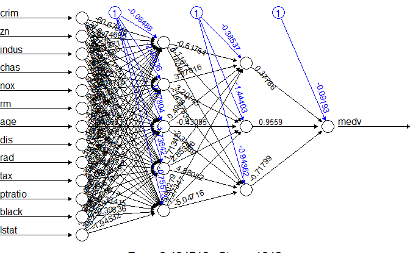

```{r include=FALSE}
knitr::opts_chunk$set(message=FALSE)
source(file = "questions/educateusgpt2.R")
```

```{r setup, include=FALSE}
knitr::opts_chunk$set(echo = TRUE, eval = TRUE)
```

```{r library, eval=TRUE, echo=FALSE, results='hide', message=FALSE, warning=FALSE}
library(xtable)
library(glmnet)
```

# R Packages for Neural Network Regression Models

Neural Networks method (in-sample and out-of-sample performance measure) is illustrated here. The package `neuralnet` and [**nnet**](http://cran.r-project.org/web/packages/nnet/nnet.pdf) are used for this purpose.

1.  `neuralnet` package

```{r, message=FALSE, echo=FALSE, eval=FALSE}
# Train a neural network model:
# - 'formula' is the formula defining the dependent variable and predictors for the model.
# - 'data=train' specifies that the training data frame used is 'train'.
# - 'hidden=c(5,3)' indicates that the model will have two hidden layers, with 5 neurons in the first layer and 3 in the second.
# - 'linear.output=T' sets the output layer to have linear activation, suitable for regression tasks.
nn <- neuralnet(formula, 
                data = train, 
                hidden = c(5, 3),
                linear.output=TRUE)
```

The arguments:

-   hidden: a vector of integers specifying the number of hidden neurons (vertices) in each layer.
-   rep: the number of repetitions for the neural network's training.
-   startweights: a vector containing starting values for the weights. The weights will not be randomly initialized.
-   linear.output: TRUE for continuous response FALSE for categorical response.

2.  `nnet` package

```{r, message=FALSE, echo=FALSE, eval=FALSE}
# Train a neural network model using the 'nnet' function from the 'nnet' package:
# - 'medv ~ .' defines the target variable 'medv' (median house value) and uses all other columns as predictors.
# - 'size = 6' specifies a single hidden layer with 6 neurons.
# - 'data = data' specifies the input data frame to train the model on.
# - 'maxit = 10000' sets the maximum number of iterations to 10,000 to ensure convergence.
# - 'decay = 0.006' adds a regularization parameter to prevent overfitting by controlling weight decay.
# - 'linout = TRUE' uses a linear output function suitable for regression problems.
Boston_nnet <- 
  nnet(medv ~ . ,
       size = 6, 
       data = data, 
       maxit=10000, decay=0.006, linout = TRUE)
```

The arguments:

-   size: number of units in the hidden layer.
-   maxit: maximum number of iterations. Default 100.
-   decay: parameter for weight decay. Default 0.
-   linout: TRUE for continuous response FALSE for categorical response (default)
-   weights: (case) weights for each example -- if missing defaults to 1.

# Neural Network model for Boston housing data

For regression problems, we use `neuralnet` and add `linear.output = TRUE` when training model. In practices, the normalization and standardization for predictors and response variable are recommended before training a neural network model. Otherwise, your neural network model may not be able to converge as the following case:

```{r, eval=FALSE, message=FALSE}
nn <- neuralnet(f, data=train_Boston, hidden=c(5), linear.output=T)
# Algorithm did not converge in 1 of 1 repetition(s) within the stepmax.
```

I chose to use the min-max method and scale the data in the interval $[0,1]$. Other reference online: [[1](https://machinelearningmastery.com/how-to-improve-neural-network-stability-and-modeling-performance-with-data-scaling/)]

```{r, message=FALSE}
library(MASS)
data("Boston")
# Calculate the maximum values for each column in the 'Boston' dataset.
maxs <- apply(Boston, 2, max)

# Calculate the minimum values for each column in the 'Boston' dataset.
mins <- apply(Boston, 2, min)

# Normalize the 'Boston' dataset using min-max scaling:
# Each feature is centered around its minimum and scaled to the range [0, 1].
scaled <- as.data.frame(scale(Boston, center = mins, scale = maxs - mins))

# Randomly sample 90% of the dataset indices for training.
index <- sample(1:nrow(Boston), round(0.9 * nrow(Boston)))

# Create a training set from the sampled indices.
train_Boston <- scaled[index,]

# The remaining 10% of indices are used to create a test set.
test_Boston <- scaled[-index,]
```


-   **Plot the fitted neural network model**:

```{r, fig.width=7}
# Load the 'neuralnet' package for training neural networks.
library(neuralnet)

# Create a formula for predicting 'medv' (median house value) using all other variables in the dataset.
f <- as.formula("medv ~ .")

# Or you can do the following way that is general and will ease your pain to manually update formula:
# resp_name <- names(train_Boston)
# f <- as.formula(paste("medv ~", paste(resp_name[!resp_name %in% "medv"], collapse = " + ")))

# Train a neural network model using the training dataset 'train_Boston':
# - 'f' is the formula defining the target variable and predictors.
# - 'hidden = c(5, 3)' specifies a neural network architecture with two hidden layers (first with 5 neurons, second with 3).
# - 'linear.output = T' indicates that the output layer is not activated (appropriate for regression problems).
nn <- neuralnet(f, data = train_Boston, hidden = c(5, 3), linear.output = TRUE)

# Plot the neural network structure to visualize the trained model.
plot(nn)

```



-   **Calculate the MSPE of the above neural network model** (what is [https://www.educateusgpt.org/sec-1-2-supervised-prediction.html#model-assessment](MSPE)?):

```{r}
pr_nn <- compute(nn, test_Boston[,1:13])

# recover the predicted value back to the original response scale 
pr_nn_org <- pr_nn$net.result*(max(Boston$medv)-min(Boston$medv))+min(Boston$medv)
test_r <- (test_Boston$medv)*(max(Boston$medv)-min(Boston$medv))+min(Boston$medv)

# MSPE of testing set
MSPE_nn <- sum((test_r - pr_nn_org)^2)/nrow(test_Boston)
MSPE_nn
```

Remark: If the testing set is not available in practice, you may try to scale the data based on the training set only. Then the recovering process should be changed accordingly. 

```{r, echo=FALSE, results='asis'}
id <- 411
que <- "Give me a few business applications that the neural network works well"
filename <- educateusgpt(id = id, question = que)
htmltools::includeHTML(filename)
```

```{r, echo=FALSE}
# Need to put the openai-api file to the very end
# since this file will be updated for every new
# chat questions inserted, so the ids need to be 
# included untill all of these questions are added.
htmltools::includeHTML("questions/openai-api.html")
```

