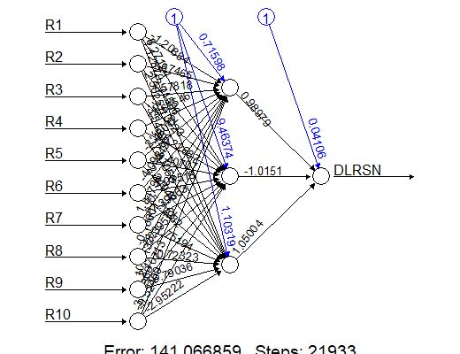

```{r include=FALSE}
knitr::opts_chunk$set(message=FALSE)
source(file = "questions/educateusgpt2.R")
```

```{r setup, include=FALSE}
knitr::opts_chunk$set(echo = TRUE, eval = TRUE)
```

```{r library, eval=TRUE, echo=FALSE, results='hide', message=FALSE, warning=FALSE}
library(xtable)
library(glmnet)
```
# Neural Network Model for Bankruptcy dataset

For classification problems, we use `neuralnet` and add `linear.output = FALSE` when training model. A common practice is again to scale/standardize predictor variables.

```{r echo=TRUE, message = FALSE,warning=FALSE, results='hide'}
# Load the bankruptcy dataset from a CSV file available online into 'Bank_data':
Bank_data_scaled <- Bank_data <- read.csv(file = "https://xiaoruizhu.github.io/Data-Mining-R/lecture/data/bankruptcy.csv", header = TRUE)

# Load the 'MASS' package for statistical functions and datasets.
library(MASS)

# Calculate the column-wise maximum ('maxs') and minimum ('mins') values for all numerical columns, excluding the first three columns.
maxs <- apply(Bank_data[,-c(1:3)], 2, max)
mins <- apply(Bank_data[,-c(1:3)], 2, min)

# Normalize the numerical data using min-max scaling and update 'Bank_data_scaled'.
# - 'center = mins' ensures the data is centered to start at its minimum values.
# - 'scale = maxs - mins' scales the data to range from 0 to 1.
Bank_data_scaled[,-c(1:3)] <- as.data.frame(scale(Bank_data[,-c(1:3)], center = mins, scale = maxs - mins))

# Split the data into training and testing sets:
# - 'sample_index' contains randomly selected row indices for training, covering 70% of the entire dataset.
# - 'Bank_train' contains the training subset of 'Bank_data_scaled'.
# - 'Bank_test' contains the remaining 30% as the testing subset.
sample_index <- sample(nrow(Bank_data_scaled), nrow(Bank_data_scaled) * 0.70)
Bank_train <- Bank_data_scaled[sample_index,]
Bank_test <- Bank_data_scaled[-sample_index,]
```

<kbd>{width="900px" height="720px"} </kbd>

```{r echo=TRUE, message=FALSE, warning=FALSE, out.height="100%", out.width="100%"}
# Load the 'neuralnet' package for training neural networks.
library(neuralnet)

# Define a formula for predicting the 'DLRSN' target variable using selected features from the dataset.
# - 'DLRSN' is the dependent variable to predict.
# - 'R1' through 'R10' are the predictor variables used in the model.
f <- as.formula("DLRSN ~ R1 + R2 + R3 + R4 + R5 + R6 + R7 + R8 + R9 + R10")

# Train a neural network model using the 'neuralnet' function:
# - 'f' specifies the target variable and predictors.
# - 'data = Bank_train' uses the training data subset for model training.
# - 'hidden = c(3)' specifies a single hidden layer with 3 neurons.
# - 'algorithm = 'rprop+'' uses the resilient backpropagation algorithm with weight backtracking.
# - 'linear.output = F' indicates a classification problem by using a logistic activation function for the output layer.
# - 'likelihood = T' calculates the likelihood, useful for evaluating model fit in classification problems.
Bank_nn <- neuralnet(f, data = Bank_train, hidden = c(3), algorithm = 'rprop+', linear.output = FALSE, likelihood = TRUE)

# Plot the structure of the trained neural network model for visualization and analysis.
plot(Bank_nn)
```



-   **In-sample fit performance**

```{r}
# Define the classification cutoff probability:
# - 'pcut_nn' is the probability cutoff threshold for classification, set to 1/36 to balance the distribution of predicted classes.
pcut_nn <- 1/36

# Predict the probabilities of the training data observations belonging to the positive class using the neural network model:
# - 'Bank_nn' is the trained neural network model.
# - 'Bank_train' contains the training data used for prediction.
# - 'type = "response"' returns the predicted probabilities.
prob_nn_in <- predict(Bank_nn, Bank_train, type = "response")

# Convert the predicted probabilities into binary class predictions based on the cutoff threshold:
# - If the predicted probability is greater than or equal to 'pcut_nn', assign 1 (positive class); otherwise, assign 0.
pred_nn_in <- (prob_nn_in >= pcut_nn) * 1

# Create a contingency table to compare the observed (actual) versus predicted classes:
# - 'Bank_train$DLRSN' is the observed target variable.
# - 'pred_nn_in' is the predicted classification result.
# - 'dnn = c("Observed","Predicted")' labels the rows (Observed) and columns (Predicted) in the table.
table(Bank_train$DLRSN, pred_nn_in, dnn = c("Observed", "Predicted"))
```

- **In-sample ROC Curve**

```{r, message=FALSE, warning=FALSE, fig.width=6, fig.height=5, fig.align='center'}
# Load the 'ROCR' package, which provides tools for visualizing and evaluating predictive models.
library(ROCR)

# Create a prediction object for model performance evaluation:
# - 'prob_nn_in' contains the predicted probabilities from the neural network.
# - 'Bank_train$DLRSN' is the actual observed target variable for the training data.
pred <- prediction(prob_nn_in, Bank_train$DLRSN)

# Generate a performance object for a Receiver Operating Characteristic (ROC) curve:
# - 'tpr' (true positive rate) will be plotted on the Y-axis.
# - 'fpr' (false positive rate) will be plotted on the X-axis.
perf <- performance(pred, "tpr", "fpr")

# Plot the ROC curve with colorized points indicating the threshold values.
plot(perf, colorize = TRUE)

# Calculate and retrieve the Area Under the Curve (AUC) for the ROC curve:
# - 'performance(pred, "auc")' returns a performance object containing the AUC.
# - 'slot(...)' retrieves the numeric value for AUC from this object.
unlist(slot(performance(pred, "auc"), "y.values"))
```

- **Model AIC/BIC and mean residual deviance**

```{r}
# Access the results matrix of the trained neural network model 'Bank_nn':
# - The 'result.matrix' holds the key information from the training process, such as biases, weights, and errors.
# - The slice '[4:5, ]' retrieves rows 4 and 5 of the results matrix, which usually contain specific metrics AIC and BIC.
Bank_nn$result.matrix[4:5,]
```

- **Out-of-sample fit performance**

```{r}
# Predict the probabilities of the testing data observations using the trained neural network model:
# - 'Bank_nn' is the trained neural network.
# - 'Bank_test' contains the testing data used for prediction.
# - 'type = "response"' returns the predicted probabilities for each observation.
prob_nn_out <- predict(Bank_nn, Bank_test, type = "response")

# Convert the predicted probabilities into binary class predictions based on the predetermined cutoff:
# - If the predicted probability is greater than or equal to 'pcut_nn', assign 1 (positive class); otherwise, assign 0.
pred_nn_out <- (prob_nn_out >= pcut_nn) * 1

# Create a contingency table to compare the observed (actual) versus predicted classes:
# - 'Bank_test$DLRSN' is the observed target variable in the testing dataset.
# - 'pred_nn_out' is the predicted classification result.
# - 'dnn = c("Observed", "Predicted")' labels the rows (Observed) and columns (Predicted) in the table.
table(Bank_test$DLRSN, pred_nn_out, dnn = c("Observed", "Predicted"))
```

- **Out-of-sample ROC Curve**

```{r, message=FALSE, warning=FALSE, fig.width=6, fig.height=5, fig.align='center'}
# Create a prediction object to evaluate model performance on the testing dataset:
# - 'prob_nn_out' contains the predicted probabilities from the neural network for the testing dataset.
# - 'Bank_test$DLRSN' is the actual observed target variable in the testing dataset.
pred_test <- prediction(prob_nn_out, Bank_test$DLRSN)

# Generate a performance object for a Receiver Operating Characteristic (ROC) curve:
# - 'tpr' (true positive rate) will be plotted on the Y-axis.
# - 'fpr' (false positive rate) will be plotted on the X-axis.
perf_test <- performance(pred_test, "tpr", "fpr")

# Plot the ROC curve with colorized points to visualize the prediction threshold values.
plot(perf_test, colorize = TRUE)

# Calculate and retrieve the Area Under the Curve (AUC) for the ROC curve:
# - 'performance(pred_test, "auc")' returns a performance object containing the AUC value.
# - 'slot(...)' retrieves the numeric AUC value from this object.
unlist(slot(performance(pred_test, "auc"), "y.values"))
```


```{r, echo=FALSE, results='asis'}
id <- 421
que <- "How large does the AUC indicate a good model?"
filename <- educateusgpt(id = id, question = que)
htmltools::includeHTML(filename)
```

```{r, echo=FALSE}
# Need to put the openai-api file to the very end
# since this file will be updated for every new
# chat questions inserted, so the ids need to be 
# included untill all of these questions are added.
htmltools::includeHTML("questions/openai-api.html")
```

